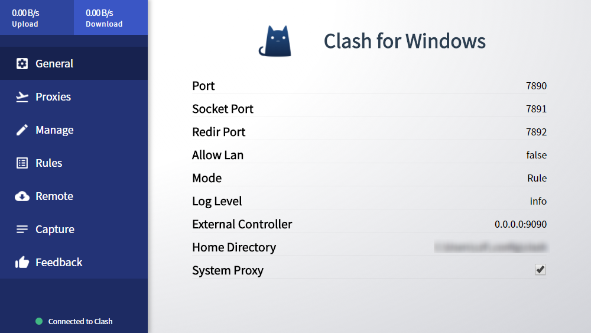

# 常规（General）

## UI介绍

在常规页面下可以清楚了解当前配置文件的设置，譬如常规的http和socks5代理端口等，方便对某些应用单独进行配置代理。

同时，General隐藏了两个小操作，在某些情况下可能有用

### Home Directory路径

当点击Home Directory右侧路径时，可以快速调转到配置文件（logs文件）目录下，方便对配置文件进行修改或者查看logs

### Clash for Windows标题

当点击Clash for Windows标题时，软件会自动进行重启，当Clash核心进程断开连接时，可以快速重启

